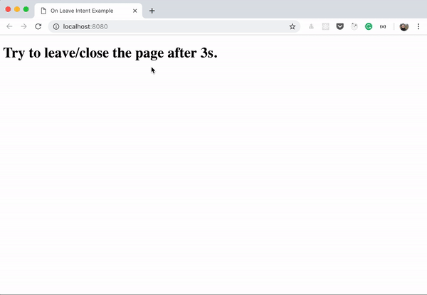

<h1 align="center">
  Don't Leave
</h1>

<p align="center">
  
  
  
  
  
  
  
</p>

<p align="center">
  <a href="#-technologies">Technologies</a>&nbsp;&nbsp;&nbsp;|&nbsp;&nbsp;&nbsp;
  <a href="#-project">Project</a>&nbsp;&nbsp;&nbsp;|&nbsp;&nbsp;&nbsp;
  <a href="#-layout">Layout</a>&nbsp;&nbsp;&nbsp;|&nbsp;&nbsp;&nbsp;
  <a href="#memo-licença">Licença</a>
</p>

<p align="center">
  
</p>

<br>

<p align="center">
  
</p>

## 🚀 Technologies

This project was developed with the following technologies:

- HTML e CSS
- JavaScript
- Babel
- Webpack
- ESLint
- Prettier
- Jest
- Git e Github

## 💻 Project

This repository hosts an application that detects when the user is about to leave the page and displays a modal. The user can choose to stay on the page or leave. The application is built using HTML, CSS, and JavaScript, and it uses Webpack for module bundling. The project is designed to be a simple demonstration of how to handle user interactions and events in a web application.

## 💻 How to run

```bash
# Clone the repository
git clone https://github.com/filipebteixeira98/dont-leave.git

# Access the project folder
cd dont-leave

# Install the dependencies
yarn install
# or
yarn

# Start the webpack development server
# You must have older versions of Node.js and npm installed due to compatibility issues with the dependencies used in this project.
# If you don't have them, you can use nvm to manage Node.js versions
# Install Node.js version 16
nvm install 16
# Use this version
nvm use 16
# Then run the command
yarn start
# The frontend will run on http://localhost:8080
```

## 📝 License

This project is under the MIT license.

<p align="center">
  Made with ♥ by me
</p>
